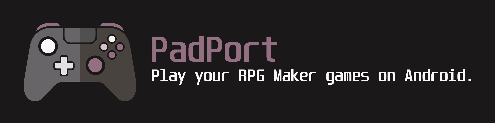
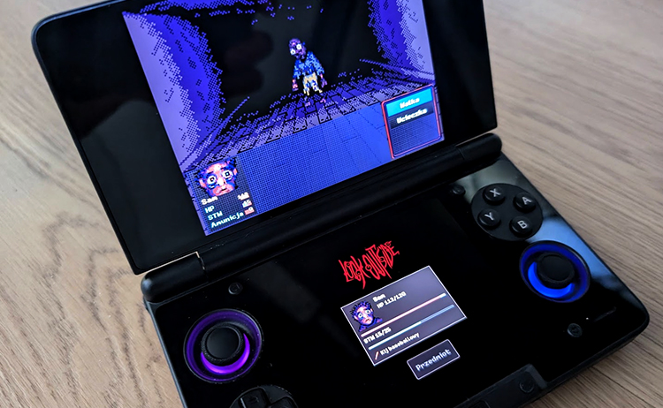

# PadPort

Play your **RPG Maker** games on Android with a controller.

Copy the game folder from your PC to your phone, tablet or handheld, add it in
PadPort and press Play. No converting, no PC needed. PadPort never changes
your game files.

## What it can do

- Plays **RPG Maker MV and MZ** games straight from their original PC folder.
- Plays **RPG Maker XP, VX and VX Ace** games too (experimental).
- Works with **Bluetooth and USB controllers** and with the built-in
  controls of handhelds like the AYN Thor.
- Optional **on-screen controller** for touch screens.
- **Button mapping and a controller tester**, so you can see exactly what the
  game gets.
- **Keyboard mode** for games that only listen to the keyboard.
- **Game library** with artwork from the game itself, from Steam, or your own
  picture.
- **Save backups**: export your saves and import them again.
- **Two screens** (e.g. AYN Thor): extra panels for *Look Outside* and
  *To the Moon* on the second screen (experimental).
- **Two browser engines** for MV / MZ games: GeckoView, the 64-bit Firefox
  engine built into PadPort (default), and the Android System WebView.
  See [Why GeckoView?](#why-geckoview)
- English and Polish, following your Android language.

## What you need

- Android 8.0 or newer.
- A 64-bit ARM device (almost every phone and handheld from the last few
  years). The downloadable APK includes ARM64 native engines.
- Your own copy of the game. PadPort does not include any games.

## Getting started

1. Download the APK from **[Releases](../../releases)** and install it.
   Android asks you to allow installing apps from this source - allow it.
2. Copy the **whole game folder** from your PC to the device, for example to
   `Download/Games/Look Outside`. If the game is in a ZIP, unpack it first.
3. Open PadPort, tap **Add game folder** and pick the game folder (the one with
   `index.html`, or the one that contains `www`). Allow access when asked.
4. Tap **Play**.

When the game gets an update on PC, copy the new files over and use
**Refresh files after a game update** in the game's ⋮ menu.

## Controls

Pair a Bluetooth controller in Android settings, plug in a USB controller, or
just use the built-in controls of your handheld. Default buttons in most
RPG Maker games:

| Button | What it does |
| --- | --- |
| A / cross | confirm, talk |
| B / circle | cancel, back |
| Y / triangle | game menu |
| L1 / R1 | previous / next page |
| D-pad or left stick | move |

Games can change these. If a button does nothing:

- Open **Controllers · mapping and test** and press it. The tester shows what
  the game receives.
- If your controller acts like a keyboard, use **Map** to teach PadPort its
  buttons.
- On the AYN Thor and similar handhelds, use the standard gamepad mode of the
  device. Touch-mapping tools of the system can catch buttons before they reach
  the app.

**On-screen controller:** turn on **Show on-screen controller** in the
controller settings or in the menu while playing. You can make it more or less
see-through with the transparency slider.

**Keyboard mode:** some games only react to the keyboard. Switch the control
mode to **Keyboard** and the controller will press keys instead (you can change
which key each button presses).

## While playing

- The game fills the screen and keeps its shape (black bars at the sides when
  the screen is wider than the game).
- The small menu button hides after 5 seconds. Touch the screen or press the
  Android Back button to bring it back.
- From that menu you can **Export saved games**, **Import save backup**, show
  the on-screen controller, turn the second screen on or off, copy a diagnostic
  log, or go **Back to library**.

## Saves

Save the normal way inside the game. Saves are kept inside PadPort, separately
for each game.

**Uninstalling PadPort or clearing its data deletes your saves.** Export them
first with **Export saved games** in the menu while playing. Exporting saves
what the game has already saved - it does not create a new save of where you
are right now.

## Two screens

> **Experimental.** The two-screen mode is new. It may be unstable, and it can
> make the game crash. Save often, and if you run into problems, turn it off in
> the game's ⋮ menu and [open an issue](../../issues/new).

On devices with a second screen (e.g. AYN Thor), PadPort can show extras there.

This needs a panel made for each game, so it works only with these games:

| Game | RPG Maker | Second screen shows |
| --- | --- | --- |
| *Look Outside* | MZ | Your party with portraits, HP, stamina, status and gear, plus an inventory button - pick an item on the bottom screen and use it. |
| *To the Moon* | XP | A notebook with Characters, Notes and Items. Tap an entry to read it. It only shows what you already have in your game. |

When you add one of these games, PadPort asks if you want the second screen.
You can turn it on or off any time in the game's ⋮ menu or in the menu while
playing. Battle commands and the game's own menus stay on the main screen.

Want this for another game? See
[Want a game supported, or a two-screen mode for it?](#want-a-game-supported-or-a-two-screen-mode-for-it)

## Why GeckoView?

MV and MZ games are web games, so PadPort needs a browser engine to run them.
It has two:

- **GeckoView** (default) - the Firefox engine. PadPort has its own copy, and
  it always runs as **64-bit**, so it has plenty of room for big games.
- **Android System WebView** - the browser engine built into Android.

Why GeckoView is the default: on some devices, like the AYN Thor, the Android
System WebView is old and runs games as a **32-bit** process. A 32-bit process
can use only about 3-4 GB of memory, and big games such as *Look Outside* can
crash there ("The game stopped"). On the Thor this WebView cannot even be
updated from Google Play.

To switch a game to the Android System WebView, open the game's ⋮ menu and
untick **Use GeckoView (64-bit engine)**. The setting is kept for each game.

**Each engine has its own saves.** After switching, the game does not see the
saves made with the other engine. They are not deleted - switch back and they
are there again. To move saves, use **Export saved games** in one engine and
**Import save backup** in the other.

If something works in one engine and not in the other, please
[open an issue](../../issues/new).

## If something goes wrong

- **The game does not start or shows an error:** open the menu while playing
  and choose **Diagnostics / copy log**, then send the log along with your
  question.
- **The game closes by itself ("The game stopped" or "Android closed the game
  to free memory"):** your saved progress is kept. For MV / MZ games, try the
  other engine with **Use GeckoView (64-bit engine)** in the game's ⋮ menu -
  saves are separate per engine, see [Why GeckoView?](#why-geckoview)
- **The game worked before an update:** use **Refresh files after a game
  update** in the game's ⋮ menu.
- **XP / VX / VX Ace games** are experimental. Games that need the RPG Maker RTP
  installed may miss graphics or sounds. MIDI music and videos do not play.
- Some MV / MZ games use special PC-only add-ons and may need extra support.
  Tell us which game it is.

## Want a game supported, or a two-screen mode for it?

**[Open an issue](../../issues/new)** and tell us:

- the game's name (and a Steam or itch.io link if there is one),
- which RPG Maker it uses (MV, MZ, XP, VX or VX Ace), if you know,
- your device and Android version,
- what happens: for example it does not start, crashes at a certain place, or
  a button does not work,
- the log from **Diagnostics / copy log**, if the game starts at all.

Want a **second-screen panel** for a game, like the ones for *Look Outside* and
*To the Moon*? Open an issue too, and write what you would like to see on the
second screen (party, map, inventory, notes...).

## For developers

- [DEVELOPMENT.md](DEVELOPMENT.md) - how it works, building, tests, why GeckoView (Polish)
- [RGSS.md](RGSS.md) - RPG Maker XP / VX / VX Ace support (Polish)
- [DUAL_SCREEN.md](DUAL_SCREEN.md) - adding second-screen profiles (Polish)

## License

PadPort source code is licensed under **GPL-3.0-or-later**. See [LICENSE](LICENSE).
Third-party components retain their respective copyright notices and licences.

The XP / VX / VX Ace support uses the **mkxp-z** engine, which is GPL, so the
APK is distributed under **GPL-3.0-or-later** together with its source code.
Details: [`app/src/main/assets/rgss/NOTICE.txt`](app/src/main/assets/rgss/NOTICE.txt).

PadPort does not include any games. Play only games you own.
